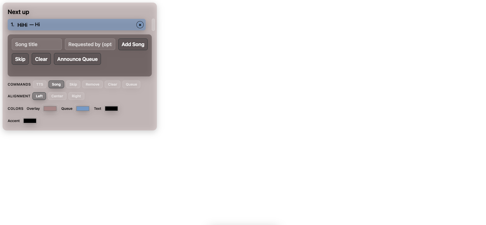
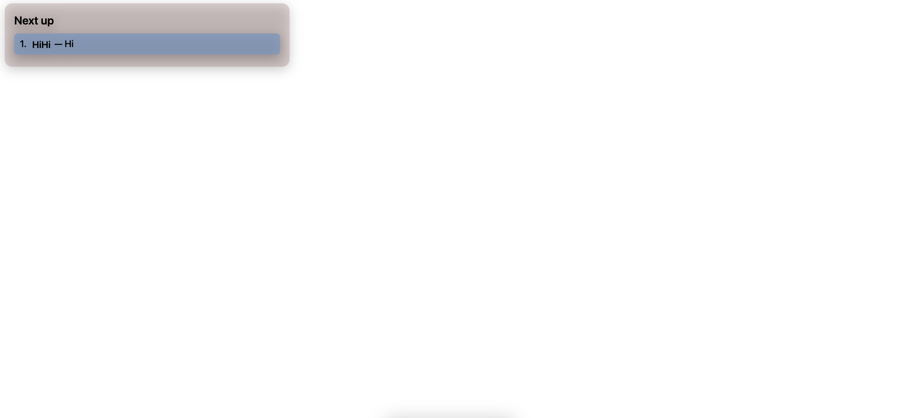

This abomination is the work of Codex. The code is definitely not pleasant to the eyes, at least it works lmao.


Demo
```
https://twitch-queue-bot-nxjb.onrender.com/
```

Point OBS browser source to your local port /overlay/ for display
https://twitch-queue-bot-nxjb.onrender.com/overlay/

<p align="center">
  
</p>

<p align="center">
  
</p>

### Quick Start (Setup)

1. **Install Node.js**  
   Download and install the current LTS release from [nodejs.org](https://nodejs.org/). Restart your computer if the installer asks you to.

2. **Download the bot files**  
   Put this folder some where easy to find (for example, your Desktop).

3. **Create a `.env` file**  
   In the project folder, create a new file named `.env` and add the settings below (replace the example values with your own):
   ```
   PORT=3000
   TWITCH_USERNAME=your_bot_account
   TWITCH_OAUTH=oauth:xxxxxxxxxxxxxxxxxxxx
   TWITCH_CHANNEL=yourstreamchannel
   OBS_URL=ws://127.0.0.1:4455
  OBS_PASSWORD=your_obs_ws_password
   ```
   *Tip:* Generate the OAuth token at [https://twitchapps.com/tmi/](https://twitchapps.com/tmi/) while logged in as your bot account.

4. **Install the app**  
   Open a terminal/command prompt in the project folder and run:
   ```
   npm install
   ```

5. **Start the bot**  
   Run:
   ```
   node index.js
   ```
   Leave this window open while you stream. You will see `Overlay: http://localhost:3000/overlay` when it is ready.

6. **Use the control panel**  
   - Open a browser and visit `http://localhost:3000/` to manage the queue (add songs, drag the width slider, change colours, toggle commands).  
   - Add a Browser Source in OBS pointing to `http://localhost:3000/overlay` (match the width/height you want). This page shows only the viewer overlay.

7. **Stop the bot**  
   When you are done streaming, return to the terminal window and press `Ctrl + C` once. The queue settings are saved automatically between sessions.

### Usage
Once the credential is added, it should allow the code to read text from twitch chat in real-time.
By putting the command !song follow text => 
```
"!song this_song_pls"
```
, it should be added into the queue automatically.
